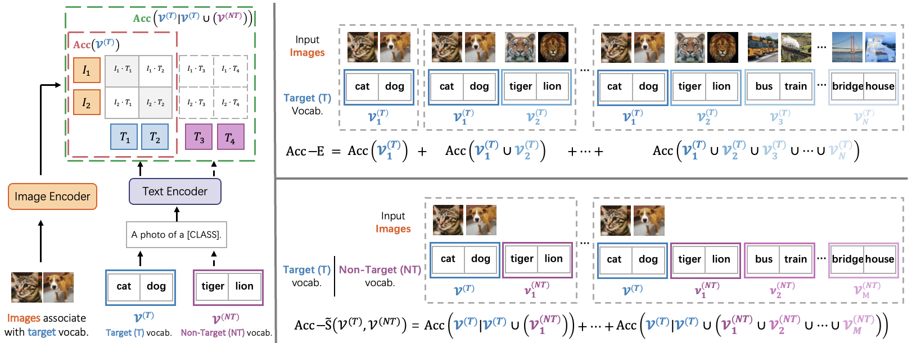

# Rethinking the Openness of CLIP


> [**Rethinking the Openness of CLIP**](https://arxiv.org/abs/2206.01986)<br>
> [Shuhuai Ren](https://renshuhuai-andy.github.io/), [Lei Li](https://leili.site/), [Xuancheng Ren](https://jklj077.github.io/), [Guangxiang Zhao](https://guangxiang.cc/), [Xu Sun](https://xusun.org/index.htm)


[](https://arxiv.org/abs/2206.01986)


Official implementation of the paper "[Rethinking the Openness of CLIP](https://arxiv.org/abs/2206.01986)".

# :rocket: News
* **(Nov 25, 2022)** 
  * Evaluation codes for Extensibility and Stability. Codes for Retrieval-Enhanced Prompt Engineering (REPE). 
  * The repository supports
[CLIP (ViT-B/16)](configs/trainers/vit_b16.yaml), [CLIP (ViT-B/32)](configs/trainers/vit_b32.yaml), [CLIP (RN101)](configs/trainers/rn101.yaml), [CLIP (RN50)](configs/trainers/rn50.yaml),
[CoOp](configs/trainers/CoOp),
[DeCLIP (ViT-B/32)](configs/trainers/vit_b32_declip.yaml), [DeCLIP (RN50)](configs/trainers/rn50_declip.yaml), 
[SLIP (ViT-B/16)](configs/trainers/vit_b16_slip_ep100.yaml), 
[FILIP (ViT-B/32)](configs/trainers/vit_b32_filip.yaml), 
and 
[DeFILIP (ViT-B/32)](configs/trainers/vit_b32_defilip.yaml)
architectures.
<hr />

## Highlights




## Main Contributions

1) **Systematical Investigation for the Openness of CLIP:** We design the evaluation protocol and two indicators of extensibility and stability.
2) **CLIP Feature Space Dissecting:** We define inter-modal alignment and intra-modal uniformity, two metrics to measure the quality of representations in contrastive learning for the vision-and-language domain.
3) **Retrieval-enhanced prompt engineering (REPE):** A simple yet effective method to improve the extensibility and stability of CLIP without fine-tuning.

## Installation 
For installation and other package requirements, please follow the instructions detailed in [INSTALL.md](docs/INSTALL.md). 

## Data preparation
Please follow the instructions at [DATASETS.md](docs/DATASETS.md) to prepare all datasets.

## Pre-trained Models
Please follow the instructions at [MODELS.md](docs/MODELS.md) to prepare all pre-trained models.

## Training and Evaluation
Please refer to the [RUN.md](docs/RUN.md) for detailed instructions on training, evaluating and reproducing the results.


<hr />

## Citation
If you use our work, please consider citing:
```bibtex
@article{Ren2022RethinkingTO,
  title={Rethinking the Openness of CLIP},
  author={Shuhuai Ren and Lei Li and Xuancheng Ren and Guangxiang Zhao and Xu Sun},
  journal={ArXiv},
  year={2022},
  volume={abs/2206.01986}
}
```

## Contact
If you have any questions, please create an issue on this repository or contact at renshuhuai007@gmail.com.


## Acknowledgements

Our code is based on [CoOp](https://github.com/KaiyangZhou/CoOp), [clip-retrieval](https://github.com/rom1504/clip-retrieval), and [DeCLIP](https://github.com/Sense-GVT/DeCLIP) repositories. We thank the authors for releasing their code. If you use our model and code, please consider citing these works as well.
